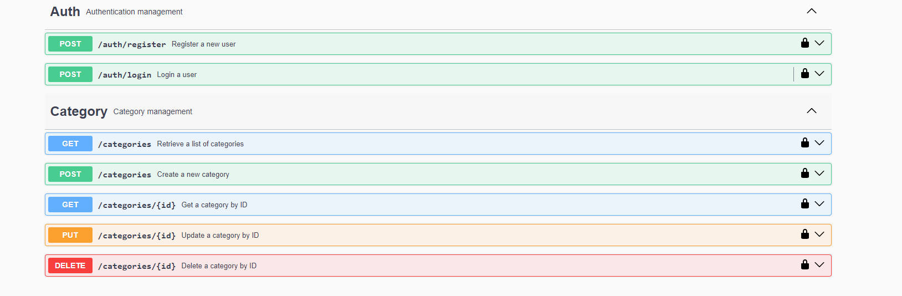
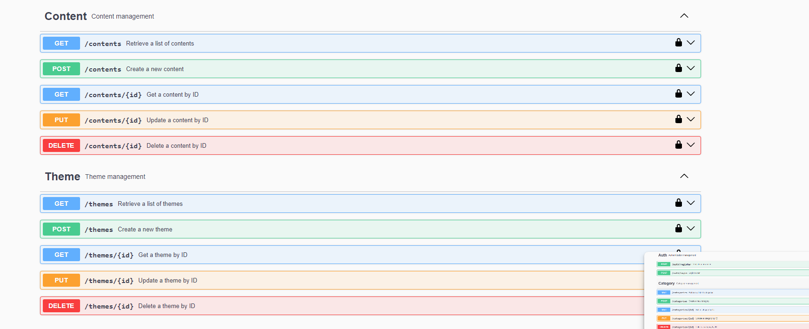
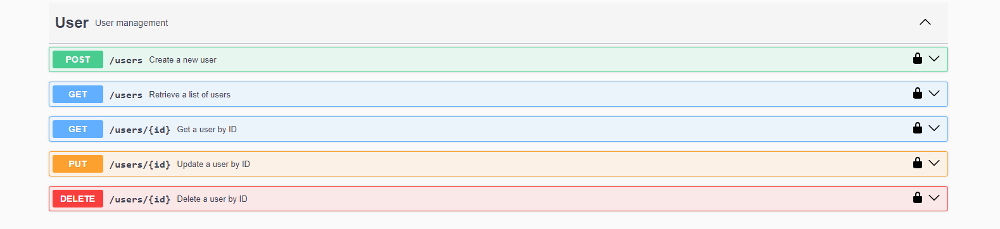

# Multimedia Content Management Backend

## Overview

This project is a backend system for managing multimedia content. It supports user roles such as Admin, Reader, and Creator, with different permissions for each role. The system allows admins to create categories and themes, assign permissions to themes, and manage multimedia content (images, videos, texts). Users can view, create, and manage content based on their roles.

## Technologies Used

- **Node.js**: JavaScript runtime for building the backend.
- **Express**: Web framework for Node.js.
- **MongoDB**: NoSQL database for storing data.
- **Mongoose**: ODM for MongoDB.
- **JWT (jsonwebtoken)**: For authentication and authorization.
- **bcryptjs**: For hashing passwords.
- **Multer**: Middleware for handling file uploads.
- **Swagger**: For API documentation.
- **Jest**: For testing.
- **Supertest**: For HTTP assertions in tests.
- **Mongo Memory Server**: For in-memory MongoDB instance during tests.

## Project Structure

```bash
management-multimedia-content-backend/
├── node_modules/
├── src/
│   ├── controllers/
│   │   ├── auth.controller.js
│   │   ├── category.controller.js
│   │   ├── content.controller.js
│   │   ├── theme.controller.js
│   │   ├── user.controller.js
│   ├── db/
│   │   ├── connect.js
│   ├── libs/
│   ├── middlewares/
│   │   ├── authJwt.js
│   │   ├── mongoId.js
│   │   ├── upload.js
│   ├── models/
│   │   ├── Category.js
│   │   ├── Content.js
│   │   ├── Role.js
│   │   ├── Theme.js
│   │   ├── User.js
│   ├── routes/
│   │   ├── auth.routes.js
│   │   ├── category.routes.js
│   │   ├── content.routes.js
│   │   ├── theme.routes.js
│   │   ├── user.routes.js
│   ├── test/
│   ├── uploads/
│   ├── app.js
│   ├── config.js
│   ├── index.js
│   ├── swaggerConfig.js
├── .env
├── .env.example
├── .gitignore
├── babel.config.js
├── jest.config.js
├── package-lock.json
├── package.json
```

## Installation and Setup

### Clone the repository:

```bash
git clone https://github.com/kaikrmen/Multimedia-Backend.git
cd multimedia-content-management-backend
```

### Install dependencies:

```bash
npm install
```

### Create a `.env` file and add the following variables:

```makefile
PORT= The port number where the server will run
MONGODB_URI= The connection string to the MongoDB database
JWT_SECRET= The secret key for the JWT token
ADMIN_EMAIL= The email of the admin user
ADMIN_USERNAME= The username of the admin user
ADMIN_PASSWORD= The password of the admin user
```

- **PORT**: The port on which the server will run.
- **MONGODB_URI**: The connection string for your MongoDB database.
- **JWT_SECRET**: Secret key for signing JWT tokens.
- **ADMIN_EMAIL**, **ADMIN_USERNAME**, **ADMIN_PASSWORD**: Credentials for the initial admin user.

### Run the server:

```bash
npm start
```

### Run the server in development mode:

```bash
npm run dev
```

### Run tests:

```bash
npm test
```

## API Documentation

The API is documented using Swagger. Once the server is running, navigate to [http://localhost:5000/api-docs](http://localhost:5000/api-docs) to view the Swagger UI documentation.

### Endpoints

#### Auth

- **POST /auth/register**: Register a new user.
- **POST /auth/login**: Login a user.

#### User

- **GET /users**: Retrieve a list of users.
- **GET /users/{id}**: Get a user by ID.
- **POST /users**: Create a new user.
- **PUT /users/{id}**: Update a user by ID.
- **DELETE /users/{id}**: Delete a user by ID.

#### Category

- **GET /categories**: Retrieve a list of categories.
- **GET /categories/{id}**: Get a category by ID.
- **POST /categories**: Create a new category.
- **PUT /categories/{id}**: Update a category by ID.
- **DELETE /categories/{id}**: Delete a category by ID.

#### Theme

- **GET /themes**: Retrieve a list of themes.
- **GET /themes/{id}**: Get a theme by ID.
- **POST /themes**: Create a new theme.
- **PUT /themes/{id}**: Update a theme by ID.
- **DELETE /themes/{id}**: Delete a theme by ID.

#### Content

- **GET /contents**: Retrieve a list of contents.
- **GET /contents/{id}**: Get a content by ID.
- **POST /contents**: Create a new content.
- **PUT /contents/{id}**: Update a content by ID.
- **DELETE /contents/{id}**: Delete a content by ID.

### Images





## User Roles and Permissions

- **Admin**: Can perform all CRUD operations on users, categories, themes, and contents.
- **Creator**: Can create, read, and update contents.
- **Reader**: Can read contents.

## Validation

- **Unique username and email**: Ensured during user registration.
- **Valid ID formats**: Ensured using middleware.
- **Permissions**: Checked based on user roles.

## Middleware

- **authJwt.js**: Verifies JWT tokens.
- **mongoId.js**: Validates MongoDB Object IDs.
- **upload.js**: Handles file uploads using Multer.

## Testing

The project includes comprehensive tests for all CRUD operations. Tests are run using Jest and Supertest with an in-memory MongoDB server provided by Mongo Memory Server.

### Running Tests

```bash
npm test
```

## Commands

### Start the server:

```bash
npm start
```

### Start the server in development mode:

```bash
npm run dev
```

### Run tests:

```bash
npm test
```

This backend system provides a robust platform for managing multimedia content with appropriate user roles and permissions, ensuring a smooth and secure user experience.